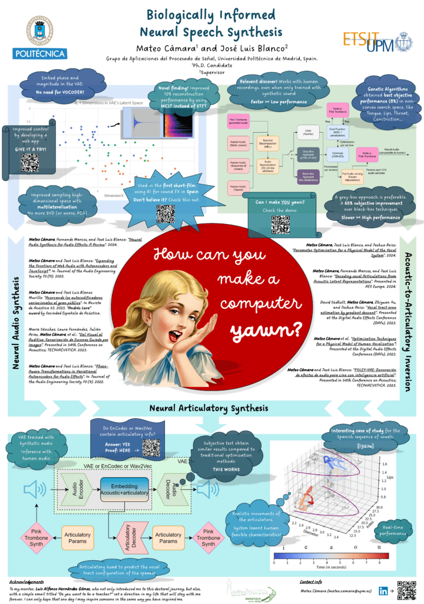
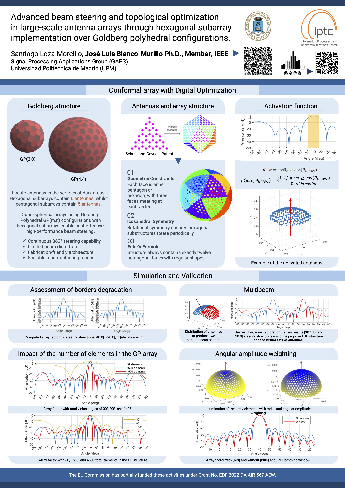

The Signal Processing Applications Group (Grupo de Aplicaciones del Procesado de Señal, GAPS) was created in 1988. It belongs to the department of Signals, Systems and Radiocommunications ([SSR](https://ssr.upm.es/)) of the Universidad Politécnica de Madrid ([UPM](https://www.upm.es/)). Our research activity includes data science, theory and analysis of systems, speech and sound technology, and intelligent electromagnetic and ultrasonic sensor systems. 

## Join us

Check the positions available in each of our research lines, specially if you are a student willing to join us for your bachelor's or master's thesis (TFG/TFM):
* [Machine Learning applied to health](../lines_ml_health)
* [Machine Learning applied to communications](../lines_ml_comm)
* [Underwater Navigation](../lines_underwater_navigation)

You can also check the contact details of the faculty [here](../people), and write us if you want to propose a topic related to what we do!

## News

* We are looking for a PhD candidate in the area of [Machine Learning applied to health](../lines_ml_health). If you are interested, send us an email with your CV, at the contact mails provided in the link.

## Recent Publications

<!-- Zoom Modal -->

  &times;
  

    
  

  
Click image to zoom • ESC to close

  <button class="slider-nav prev" onclick="moveSlide(-1)">❮</button>
  <button class="slider-nav next" onclick="moveSlide(1)">❯</button>
  
  

    <!-- Slide 1 -->
    

      
      

        <h3>DeCaFlow: A Deconfounding Causal Generative Model</h3>
        
Almodóvar, A., et al. - NeurIPS 2025 • Click to view publication →

      

    

    <!-- Slide 2 -->
    

      
      

        <h3>Biologically Informed Neural Speech Synthesis</h3>
        
In Proc. IberSPEECH 2024 (pp. 261-265) • Click to view publication →

      

    

    

      
      

      

    

    <!-- Add more slides as needed -->
  

  
  

  
  

    <a href="../publications">View All Publications →</a>
  

